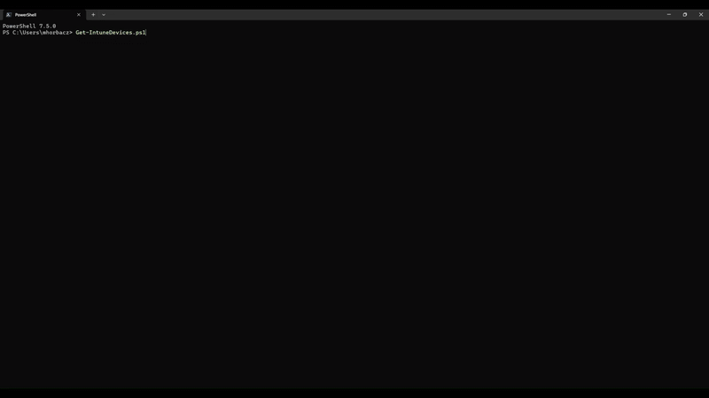

# Intune-Tools

## Get-IntuneDevices  

### Overview  

**Get-IntuneDevices** is a PowerShell tool designed to quickly retrieve Intune-managed device details from an **Entra ID group**. Microsoft Intune and Entra ID do not provide a straightforward way to fetch device objects from a given group. While exporting CSV files or running PowerShell queries is possible, this script simplifies the process into **three easy steps**.  

### Features  

- Fetches **Intune-managed devices** from a specified Entra ID group (users & devices).  
- Supports authentication via **Microsoft Graph API** (using Tenant ID or Access Token).  
- Retrieves detailed device attributes, including:  
  - **Device Name, Compliance State, OS, OS Version, Enrollment Date, Last Check-In, Serial Number, Manufacturer, and more.**  
- Provides multiple output formats:  
  - **Table view** for quick visualization.  
  - **List view** for detailed inspection.  
  - **CSV export** for further analysis.  

### Installation  

Install the script directly from **PowerShell Gallery**:  

```powershell
Install-Script Get-IntuneDevices -Scope CurrentUser -Force
```

Ensure you have the required **Microsoft Graph module** installed:  

```powershell
Install-Module Microsoft.Graph -Scope CurrentUser -Force
```

### Usage  


1. **Run the script** in PowerShell:  

   ```powershell
   Get-IntuneDevices
   ```

2. **Authenticate** using either:  
   - **Access Token** (if you already have one).  
   - **Tenant ID** (interactive login with Microsoft Graph).  

3. **Enter an Entra ID group** (paste the group link or GUID).  

4. Choose how to display or export the results:  
   - **View as Table**  
   - **View as List**  
   - **Export to CSV**  

## Example  

```
Select an option:
1. Set Tenant or AccessToken  
2. Disconnect from Tenant  
3. Check group  
4. Show devices as table  
5. Show devices as list  
6. Export devices to CSV  
7. Exit  
Enter choice (1-7):  
```
____
## Intune Admin Center Tools

A browser extension that brings useful features Microsoft should've included in the first place. Built openly, without marketing fluff or red tape — just practical tools for real admins.

⚠️ Security Advisory

This extension retrieves your Graph API token from browser storage and uses it as an Authorization header in Microsoft Graph requests.

Read the code. Trust your gut. It's public software from a developer on the internet — be cautious and audit before use.

### Features

Once you're viewing a device in Intune Admin Center, open the extension to:

× Group Management
  × Search Azure AD groups by name
  × Add or remove the current device from groups
  × Create new security groups (non-mail-enabled)
× Configuration Assignments
  * View device config profiles and assigned groups
* Compliance Policies
  * Inspect compliance policies and their targets
* Application Assignments
  * Review app deployment assignments for the device or user
* PowerShell Scripts
  * See which scripts are applied
  * Download script contents (decoded)
* Dark/Light Mode Toggle 💪

### Browser Compatibility
* Chrome – Fully supported
* Edge – Fully supported
* Other Chromium browsers – Might work, untested

### Platform Support

Windows is fully supported. Other platforms might work — partial support for now, improvements coming.

### AI Disclaimer

Some parts were built with AI assistance. If it breaks, it might be my fault—or the AI’s. Either way, report an issue and we’ll fix it.

### Screenshots


 


### Installation (Developer Mode)

1. Download or clone this repo
2. Go to chrome://extensions or edge://extensions
3. Enable Developer Mode
4. Click Load unpacked
5. Select the project directory

### Tool Status
Still in active development. May slow down if real life gets in the way. Contributions, feedback, and stars always appreciated.
