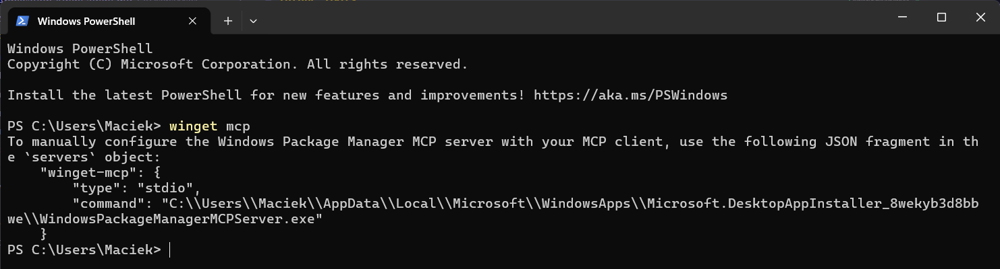
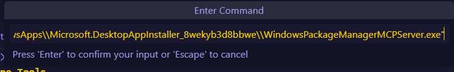
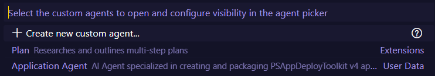
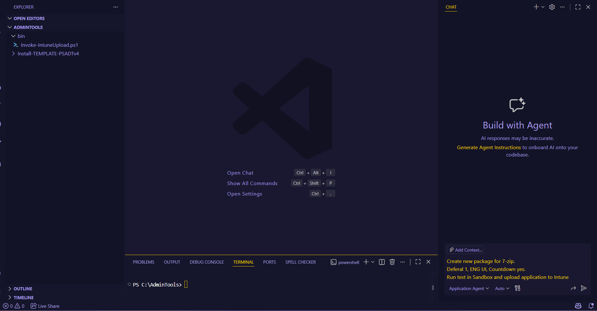
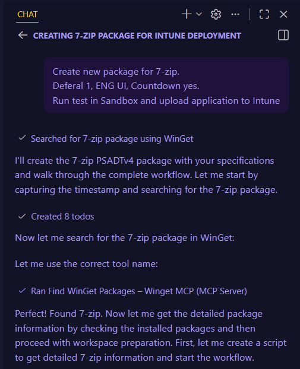

# Intune-Tools

## Win32 Applications AI Agent

### Overview

So, I was using GitHub Copilot's agent capabilities and kept thinking: "What could AI actually do beyond just writing code?" And then it hit me! 💡

Enter the **✨Applications Agent✨** - your new best friend for packaging Win32 apps for Intune. This thing takes what's normally a multi-hour slog of copying templates, editing configs, testing in Sandbox, and uploading to Intune... and turns it into a guided conversation with an AI that (mostly) knows what it's doing.

### What Does It Actually Do?

Here's the magic workflow:

1. **Finds Your App** 🔍
   - Uses WinGet MCP to search for applications (fancy!) or falls back to plain PowerShell WinGet if MCP isn't available
   - Most of the time it works... *most* of the time

2. **Sets Up The Package** 📦
   - Copies the `Install-TEMPLATE-PSADTv4` template
   - Auto-fills all the boring stuff like app name, vendor, version
   - Asks you the important questions: How many deferrals? What language? Countdown timer?

3. **Wraps It Up** 🎁
   - Connects to [Intune-App-Sandbox](https://github.com/UniverseCitiz3n/Intune-App-Sandbox) to create that sweet `.intunewin` file
   - Because manually running IntuneWinAppUtil is so 2019

4. **Tests in Sandbox** 🧪
   - Spins up Windows Sandbox and installs the package
   - Watches for the results like a nervous parent at a school play
   - Looks for `0.code` (success!) or `1.code` (oops...)

5. **Ships It to Intune** 🚀
   - If the test passes (fingers crossed!), it's upload time
   - Grabs a pretty icon from [Companyportalicons.com](https://github.com/MrtnRQL/Companyportaliconsdotcom)
   - Reads detection rules from `detection.csv`
   - Uploads using `Invoke-IntuneUpload.ps1` (you'll need to paste in an OAuth token)

### What You'll Need

Before we get this party started, make sure you've got:

#### The Essentials

* **Visual Studio Code** - You're probably already here
* **GitHub Copilot** - With agent capabilities (the fun stuff)
* **Windows Sandbox** - Turn it on in Windows Features if you haven't already
* **PowerShell 5.1+** - Already on your machine if you're running anything newer than Windows 8

#### The Important Bits

* **[Intune-App-Sandbox](https://github.com/UniverseCitiz3n/Intune-App-Sandbox)** - Does the heavy lifting for packaging and testing
* **PSAppDeployToolkit v4** - I've included my template in this repo, but feel free to grab the vanilla version from [psappdeploytoolkit](https://github.com/psappdeploytoolkit/psappdeploytoolkit) if you want the latest and greatest

#### Nice to Have

* **WinGet MCP** - Makes app discovery way smoother through Model Context Protocol
  - The agent can totally work without it (falls back to PowerShell WinGet)
  - But MCP gives it a little extra *oomph* 💪

#### Access Stuff

* **Microsoft Intune** - Obviously, you'll need admin access to your tenant
* **OAuth Token** - Don't worry about this yet, you'll get it during the upload process

### Installation & Setup

### Setup Time!

#### Step 1: Get Intune-App-Sandbox Running

Head over to the [Intune-App-Sandbox README](https://github.com/UniverseCitiz3n/Intune-App-Sandbox) and follow the setup instructions. This is the secret sauce that makes the packaging and testing magic happen.

#### Step 2: WinGet MCP (Optional but Seriously, Do It)

Although the agent works without WinGet MCP (it'll just use PowerShell to run WinGet), I think MCP gives it a little more confidence. Like wearing a nice shirt to a job interview - not required, but it helps.

**Here's how to hook it up:**






#### Step 3: Create Your App Agent

This is the fun part!

**Click on `Configure Custom Agent`:**


**Then hit `New`:**



**Now the easy part:**
- Pick where to save your agent config
- Name it "Application Agent" (or whatever makes you happy)
- Copy all the contents from [`Application Agent.agent.md`](Agent/Application%20Agent.agent.md)
- Paste it in and save

Boom! You've got yourself an AI agent.

### How to Use This Thing

Okay, time to actually use it!

**Step 1:** Open your VSCode workspace with `Invoke-IntuneUpload.ps1` and the PSADT template

**Step 2:** Fire up the Copilot Chat, select your Application Agent, and just... tell it what you want

Like this:
```
Package Google Chrome for Intune
```
or
```
Create 7-Zip package with 3 deferrals
```

**Step 3:** Hit enter and watch the magic happen ✨





Now here's where you have choices:

#### The Careful Approach (Recommended for First Timers)
Review and approve each action as it asks. This way you'll:
- Actually understand what's happening
- Catch any weirdness early
- Learn the process for next time
- Feel like you're in control (you are!)

#### The YOLO Approach
Set auto-approve, grab a coffee, and let it run. ☕

⚠️ **Fair warning:** This is like giving your car keys to a teenager. It *probably* won't crash, but you should at least keep an eye on things.

### Pro Tips

- **Watch the logs** - If something goes sideways, the clues are usually there
- **Test in Sandbox first** - I mean, that's literally what it does, but don't skip this
- **Check your detection rules** - Make sure `detection.csv` is set up right
- **Icon check** - The agent will grab one automatically, but make sure it's not something weird
- **Have your OAuth token ready** - My favorite approach is Browser DevTools

### When Things Go Wrong

Because they sometimes do:

- **"WinGet not found"** - Install WinGet or check if it's in your PATH
- **Sandbox won't start** - Did you enable Windows Sandbox in Windows Features?
- **Upload fails** - Check your OAuth token and make sure you have Intune admin rights
- **Missing detection rules** - Look for `detection.csv` in your package folder

## Get-IntuneDevices  

### Overview  

**Get-IntuneDevices** is a PowerShell tool designed to quickly retrieve Intune-managed device details from an **Entra ID group**. Microsoft Intune and Entra ID do not provide a straightforward way to fetch device objects from a given group. While exporting CSV files or running PowerShell queries is possible, this script simplifies the process into **three easy steps**.  

### Features  

* Fetches **Intune-managed devices** from a specified Entra ID group (users & devices).  
* Supports authentication via **Microsoft Graph API** (using Tenant ID or Access Token).  
* Retrieves detailed device attributes, including:  
  * **Device Name, Compliance State, OS, OS Version, Enrollment Date, Last Check-In, Serial Number, Manufacturer, and more.**  
* Provides multiple output formats:  
  * **Table view** for quick visualization.  
  * **List view** for detailed inspection.  
  * **CSV export** for further analysis.  

### Installation  

Install the script directly from **PowerShell Gallery**:  

```powershell
Install-Script Get-IntuneDevices -Scope CurrentUser -Force
```

Ensure you have the required **Microsoft Graph module** installed:  

```powershell
Install-Module Microsoft.Graph -Scope CurrentUser -Force
```

### Usage  


1. **Run the script** in PowerShell:  

   ```powershell
   Get-IntuneDevices
   ```

2. **Authenticate** using either:  
   * **Access Token** (if you already have one).  
   * **Tenant ID** (interactive login with Microsoft Graph).  

3. **Enter an Entra ID group** (paste the group link or GUID).  

4. Choose how to display or export the results:  
   * **View as Table**  
   * **View as List**  
   * **Export to CSV**  

## Example  

```
Select an option:
1. Set Tenant or AccessToken  
2. Disconnect from Tenant  
3. Check group  
4. Show devices as table  
5. Show devices as list  
6. Export devices to CSV  
7. Exit  
Enter choice (1-7):  
```
